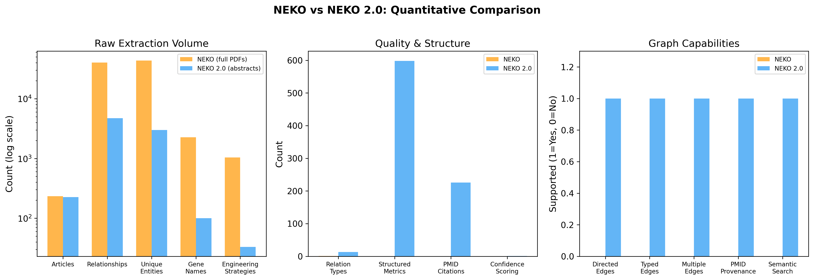
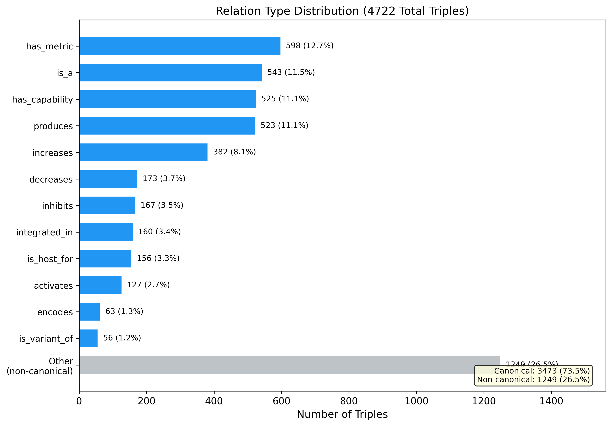
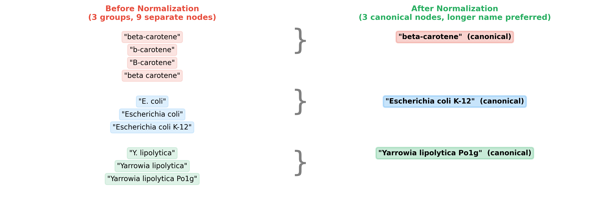
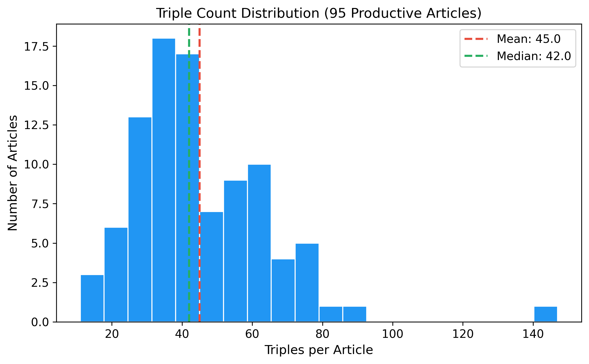

# NEKO 2.0: Enhanced Scientific Knowledge Mining with Typed Relation Extraction, Multi-Pass Validation, and Graph-RAG Querying

**Authors:** [Your Name], Zhengyang Xiao, Yixin Chen, Yinjie J. Tang

**Affiliation:** Washington University in St. Louis

---

## Abstract

Large language models (LLMs) can answer general scientific questions, but they cannot provide specific, cited knowledge from recent literature. The NEKO (Network for Knowledge Organization) workflow addressed this gap by using LLMs to extract entity pairs from PubMed abstracts and build knowledge graphs. However, NEKO had several limitations: it extracted only untyped entity pairs without relationship labels, used a single extraction pass per abstract, built undirected graphs that lost causal directionality, and supported only keyword-based graph search. In this work, we present NEKO 2.0, an enhanced workflow with eight major improvements: (1) typed triple extraction with a 13-relation controlled ontology replacing untyped pairs, (2) three-pass extraction with independent validation increasing recall, (3) Jaccard stability scoring providing per-article confidence metrics, (4) LLM-driven query generation with a four-tier PubMed search strategy replacing manual keywords, (5) relation normalization mapping 41 synonyms to canonical terms, (6) improved entity normalization with longer-name canonicalization and transitive chain resolution, (7) directed multigraph construction preserving causal direction and edge multiplicity, and (8) semantic Graph-RAG querying with anti-hallucination answer generation. We demonstrate these improvements through case studies on Rhodococcus lipid production, comparing NEKO 2.0 against the original NEKO on the same research topics. NEKO 2.0 extracts richer, more structured knowledge from scientific literature while providing quantitative confidence measures and grounded, citation-backed answers. The code is available at https://github.com/Up14/Knowledge.

---

## 1. Introduction

The rapid growth of scientific literature presents a major challenge for researchers. PubMed alone contains over 36 million citations, with thousands added daily. Reading and organizing this information manually is slow and incomplete. LLMs such as GPT-4 can answer scientific questions, but their responses are limited by pretraining cutoff dates and they cannot cite specific sources (Xiao et al., 2025).

NEKO (Xiao et al., 2025) addressed this problem by combining PubMed literature search with LLM-based entity extraction and knowledge graph construction. When a user provides a search keyword, NEKO retrieves relevant abstracts from PubMed, uses an LLM to extract causal entity pairs from each abstract, merges similar entities using sentence embeddings, and builds an interactive knowledge graph. Case studies on beta-carotene production in *Yarrowia lipolytica* and cyanobacterial biorefinery showed that NEKO's output contained 200% more gene targets and 200% more strain engineering strategies compared to GPT-4 zero-shot responses.

Despite these contributions, we identified several limitations in the original NEKO workflow during extended use:

- **No relationship typing.** NEKO extracted entity pairs in the format (Entity A, Entity B) without specifying what type of relationship exists between them. A pair like (gene_X, beta-carotene) could mean gene_X produces, inhibits, or encodes something related to beta-carotene. This ambiguity limits the usefulness of the knowledge graph for mechanistic reasoning.
- **Single-pass extraction.** Each abstract was processed by the LLM only once. If the LLM missed a relationship in its first response, that information was lost.
- **No confidence measurement.** There was no way to assess how reliable the extracted relationships were for any given article.
- **Manual keyword search.** Users had to provide exact search keywords. The system did not help with query formulation or synonym expansion.
- **Undirected graphs.** The knowledge graph used undirected edges, losing the causal direction of relationships (e.g., "gene X activates pathway Y" became indistinguishable from "pathway Y activates gene X").
- **Keyword-only graph querying.** Users could only search the graph by exact substring matching on entity names, requiring prior knowledge of the exact terminology used in the literature.
- **No answer grounding.** When generating summary reports from the knowledge graph, the LLM could add information from its training data that was not present in the extracted literature, leading to potential hallucination.

In this work, we present NEKO 2.0 with the following improvements that address each limitation:

1. **Typed triple extraction with controlled ontology.** We replace untyped (Entity A, Entity B) pairs with typed (Subject, Relation, Object) triples using a 13-relation biological ontology, enabling mechanistic reasoning on the knowledge graph.
2. **Multi-pass extraction.** We extract relationships from each abstract using three sequential passes (exhaustive, overlooked scan, gap-filling) followed by an independent validation pass, increasing extraction recall.
3. **Jaccard stability scoring.** We compute a per-article confidence score measuring agreement between extraction and validation passes, enabling quality-based filtering.
4. **LLM-driven four-tier query generation.** We replace manual keywords with LLM-based concept decomposition that generates four complementary PubMed queries ranging from broad to targeted.
5. **Relation normalization.** We introduce a post-extraction normalization step that maps 41 relationship synonyms (e.g., "enhances", "upregulates", "stimulates") to 13 canonical terms, ensuring consistent graph structure.
6. **Improved entity normalization.** We increase the similarity threshold from 0.80 to 0.85, select the longer (more descriptive) entity name as canonical, and resolve transitive normalization chains.
7. **Directed multigraph construction.** We build directed multigraphs that preserve causal direction and allow multiple typed edges between the same entity pair from different sources.
8. **Semantic Graph-RAG with anti-hallucination.** We replace keyword search with embedding-based semantic search over triples and enforce strict evidence-grounding rules in answer generation.

The remainder of this paper is organized as follows. Section 2 reviews related work. Section 3 briefly describes the original NEKO system. Section 4 presents the NEKO 2.0 methods in detail. Section 5 describes our experimental setup. Section 6 presents results and comparisons. Section 7 discusses findings and limitations. Section 8 concludes the paper.

---

## 2. Related Work

### 2.1 LLM-Based Scientific Knowledge Extraction

Since the publication of NEKO, the landscape of LLM-based scientific tools has expanded. General-purpose tools like Elicit, Semantic Scholar, and Consensus use language models to search and summarize scientific literature. However, these tools typically produce text summaries rather than structured knowledge graphs. BioGPT (Luo et al., 2022) and PubMedGPT (Bolton et al., 2024) are domain-specific models fine-tuned on biomedical text, but they still face hallucination issues when generating answers without grounding in specific retrieved documents.

### 2.2 Biomedical Knowledge Graph Construction

Traditional biomedical knowledge graph construction relies on named entity recognition (NER) and relation extraction (RE) pipelines, often using supervised models trained on annotated datasets. Tools like PubTator (Wei et al., 2024) and BERN2 (Kim et al., 2022) provide NER for biomedical entities, but they require pre-defined entity types and labeled training data. Recent work has explored using LLMs for zero-shot or few-shot relation extraction (Wadhwa et al., 2023), but these approaches typically extract from individual documents without aggregating knowledge across a corpus.

### 2.3 Graph-RAG and Retrieval-Augmented Generation

Retrieval-Augmented Generation (RAG) combines retrieval systems with language models to ground outputs in specific documents (Lewis et al., 2020). Graph-RAG extends this by using knowledge graphs as the retrieval structure rather than flat document collections. Microsoft's GraphRAG (Edge et al., 2024) demonstrated that graph-based retrieval can produce more comprehensive answers than traditional RAG for questions requiring synthesis across multiple documents. NEKO 2.0 applies this principle by using semantic search over knowledge graph triples as the retrieval mechanism.

---

## 3. Background: The Original NEKO System

We briefly summarize the original NEKO workflow (Xiao et al., 2025); full details are in the original publication.

NEKO operates in four stages (Figure 1a):

**Stage 1: Literature Search.** The user provides a search keyword (e.g., "rhodococcus"). NEKO queries PubMed using the Entrez API with the format `keyword[Abstract]` and retrieves up to 200-300 article titles and abstracts.

**Stage 2: LLM Entity Extraction.** Each abstract is sent to an LLM (Qwen1.5-72B or GPT-4) with a system prompt instructing it to identify causal entity pairs in the format (Entity A, Entity B). The LLM processes each abstract once, producing a list of entity pairs per article.

**Stage 3: Entity Deduplication and Knowledge Graph Construction.** All extracted entities are embedded using the sentence-transformers model `all-MiniLM-L6-v2`. Entities with cosine similarity above 0.80 are merged, with the first-seen entity becoming canonical. The deduplicated entity pairs are assembled into an undirected graph using NetworkX and visualized with Pyvis.

**Stage 4: Search and Summarization.** Users search the knowledge graph by keyword substring matching. Matching nodes and their neighbors are extracted, and the node names are sent to an LLM with a generic prompt to generate a summary report.

---

## 4. Methods: NEKO 2.0

Figure 2 shows the complete NEKO 2.0 pipeline alongside the original. Table 1 provides a component-by-component comparison. Changed and new components are described in detail below.

### Table 1: Component Comparison Between NEKO and NEKO 2.0

| Component | NEKO (Original) | NEKO 2.0 | Change Type |
|---|---|---|---|
| Query construction | Manual keyword | LLM concept decomposition + 4-tier queries | **Replaced** |
| PubMed retrieval | Single query, max 200-300 | Batched, up to 100,000, with retry and dedup | **Enhanced** |
| Relevance pre-filter | None | Keyword-based abstract filtering | **New** |
| Abstract chunking | None (whole abstract) | Sentence-boundary splitting with scientific abbreviation handling | **New** |
| Extraction format | Untyped pairs (A, B) | Typed triples (S, R, O) with 13-relation ontology | **Replaced** |
| Extraction passes | 1 pass | 3 passes + validation | **Replaced** |
| Confidence scoring | None | Jaccard stability score | **New** |
| Relation normalization | None | 41-synonym mapping to 13 canonical terms | **New** |
| Entity normalization | Cosine > 0.80, arbitrary canonical | Cosine > 0.85, longer-name canonical, transitive chains | **Enhanced** |
| Graph structure | Undirected simple graph | Directed multigraph | **Replaced** |
| Graph search | Keyword substring + BFS | Semantic embedding search | **Replaced** |
| Answer generation | Generic LLM summary | Anti-hallucination grounded generation with citations | **Replaced** |

---

### 4.1 LLM-Driven Query Generation

Instead of requiring users to manually provide PubMed search keywords, NEKO 2.0 accepts a natural language research goal (e.g., "lipid production in Rhodococcus using metabolic engineering") and automatically generates optimized PubMed queries.

**Step 1: Concept Extraction.** The research goal is sent to an LLM with a system prompt instructing it to decompose the goal into four structured categories: compound (the main chemical or molecule), organism (the target species), process (the biological action), and other (additional constraints). The LLM returns a JSON object with synonyms for each category. This call uses temperature=0 to ensure deterministic output.

**Step 2: Four-Tier Query Construction.** From the extracted concepts, four complementary PubMed queries are constructed:

- **Baseline query**: Core terms combined with AND, no field tags. Generic noise words ("study", "research", "review", "effect") are filtered out. This serves as a broad safety net.
- **Broad query**: Compound and organism terms with synonyms grouped by OR, tagged with [tiab] (title-and-abstract field restriction).
- **Specific query**: All core concepts (compound, organism, process) with [tiab] tags.
- **Targeted query**: All concepts including additional constraints, all [tiab] tagged. This is the most precise query.

Multi-word terms are automatically quoted for exact matching (e.g., `"metabolic engineering"[tiab]`). Article IDs from all four queries are combined and deduplicated. Both the extracted concepts and final queries are cached using MD5 hashing of the goal text, ensuring that the same goal always produces the same queries.

### 4.2 Scalable PubMed Retrieval

NEKO 2.0 fetches PubMed article IDs in batches of 10,000 with a safety cap of 100,000 articles. Each batch has three retry attempts with exponential backoff. Article metadata (title, abstract, journal, PMID) is fetched in batches of 200 following NCBI guidelines, with rate-limiting pauses between batches. Articles with empty or missing abstracts are filtered out. PMIDs are stored for each article to enable downstream citation tracing.

### 4.3 Relevance Pre-Filtering

Before sending abstracts to the LLM (the most time-consuming step), NEKO 2.0 applies a lightweight relevance filter. Keywords longer than three characters are extracted from the research goal, and abstracts that do not contain any of these keywords are removed from processing. In the beta-carotene case study, only 1 of 227 articles (0.4%) was filtered out, indicating that the LLM-generated queries were already well-targeted. For broader or noisier research goals, this filter is expected to save a larger percentage of LLM API calls.

### 4.4 Sentence-Boundary Abstract Chunking

Long abstracts are split into chunks of at most 2,000 characters at sentence boundaries. The sentence splitter uses negative lookbehind regular expressions to handle seven common scientific abbreviation patterns that create false sentence boundaries: "et al.", "sp.", "spp.", "vs.", "Fig.", single-capital abbreviations (e.g., "E." in "E. coli"), and mid-abbreviation patterns (e.g., "U.S.A."). Sentences are accumulated greedily into chunks, ensuring no chunk breaks mid-sentence.

### 4.5 Typed Triple Extraction with Controlled Ontology

The most significant change in NEKO 2.0 is the replacement of untyped entity pairs with typed triples. Instead of extracting (Entity A, Entity B), the system now extracts (Subject, Relation, Object) where the Relation is constrained to a controlled ontology of 13 biological relationship types:

| Relation | Meaning | Example |
|---|---|---|
| activates | Positive regulation or activation | (promoter_TEF, activates, gene_HMG1) |
| inhibits | Negative regulation or suppression | (CRISPRi, inhibits, competing_pathway) |
| produces | Biosynthetic production | (Y. lipolytica, produces, beta-carotene) |
| is_variant_of | Strain or genetic variant | (strain_Po1g, is_variant_of, Y. lipolytica) |
| encodes | Gene-protein encoding relationship | (carRP, encodes, bifunctional_lycopene_cyclase) |
| is_host_for | Host organism for production | (E. coli, is_host_for, mevalonate_pathway) |
| increases | Quantitative increase | (codon_optimization, increases, protein_expression) |
| decreases | Quantitative decrease | (gene_knockout, decreases, byproduct_formation) |
| integrated_in | Genomic integration | (expression_cassette, integrated_in, chromosome_A) |
| has_capability | Functional capability | (R. toruloides, has_capability, lipid_accumulation) |
| is_a | Taxonomic or categorical classification | (beta-carotene, is_a, carotenoid) |
| has_metric | Quantitative measurement | (strain_X, has_metric, "39.5 g/L") |
| is_produced_by | Reverse production relationship | (fatty_acids, is_produced_by, R. toruloides) |

The extraction prompt explicitly enforces this ontology and includes specific rules for handling numeric data. Measurements are separated into dedicated `has_metric` triples rather than being embedded in entity names. For example, instead of extracting (strain_X, produces, "39.5 g/L beta-carotene") as a single relationship, the system extracts two triples: (strain_X, produces, beta-carotene) and (strain_X, has_metric, "39.5 g/L"). This prevents combinatorial entity explosion where every unique measurement creates a new entity.

The prompt also includes quality rules instructing the LLM to avoid fuzzy relationship terms (e.g., "enables" should be replaced with "activates" or "facilitates") and to extract specific engineering strategies (e.g., (gene_X, integrated_in, chromosome_Y)).

### 4.6 Multi-Pass Extraction

Instead of processing each abstract chunk once, NEKO 2.0 performs three sequential extraction passes, each at temperature=0 for deterministic output:

**Pass 1 (Exhaustive Extraction).** The LLM is instructed to extract ALL biological relationships, including causal, mechanistic, associative, implied, and weak interactions. The prompt specifies the relation ontology and asks for comprehensive coverage of genes, proteins, pathways, compounds, and processes. The research goal is provided as context to focus extraction.

**Pass 2 (Overlooked Scan).** The LLM receives the results from Pass 1 and is asked to re-scan for overlooked interactions and engineering details. The user message explicitly includes "Already found: [Pass 1 results]" so the model can focus on what was missed.

**Pass 3 (Gap-Filling).** The LLM receives all triples found in Passes 1 and 2 and is asked to identify any remaining missing biological relationships.

Triples from all three passes are merged through set union. No triples are discarded. This ensures that each pass adds to the total knowledge without removing contributions from previous passes.

### 4.7 Jaccard Stability Scoring

After the three extraction passes, a separate validation pass runs with a different LLM persona: "Critical Bio-Analyst." This persona independently verifies and extracts the top biological interactions from the same abstract, without seeing the previous extraction results.

A Jaccard stability score is then computed for each article:

```
Stability = |Extraction Triples INTERSECT Validation Triples| / |Extraction Triples UNION Validation Triples|
```

This score ranges from 0.0 (no agreement between extraction and validation) to 1.0 (perfect agreement). It provides a quantitative per-article confidence metric. Articles with low stability scores can be flagged for manual review or filtered from downstream analysis. Validation triples are also merged into the final set, so no information is lost even from the validation step.

### 4.8 Relation Normalization

After extraction, NEKO 2.0 applies a normalization step that maps 41 relationship synonyms to 13 canonical terms. This step is necessary because different LLM outputs and different papers use different words for the same biological relationship. For example, the words "induces", "enhances", "stimulates", "upregulates", and "promotes" all describe positive regulation and are mapped to the canonical term `activates`.

The complete normalization mapping covers the following groups:

- **activates** (10 synonyms): induces, enhances, stimulates, upregulates, promotes, facilitates, positive_regulator, triggers, initiates
- **inhibits** (9 synonyms): reduces, suppresses, downregulates, blocks, interferes, negative_regulator, diminishes, represses, attenuates
- **produces** (5 synonyms): produced, synthesized, secreted, generates, yields
- **Common LLM outputs** (8 synonyms mapped to activates/produces): degrades, metabolizes, catalyzes, binds, regulates, converts, transports, modifies
- **is_a** (3 synonyms): "is a", "belongs to", "classified as"
- **Functional** (3 synonyms): is_a_variant_of, integrated_into, has metabolic capability
- **Metrics** (2 synonyms): "increases titer by", "enhanced production"
- **Host** (1 synonym): "used as host for production of"

Normalization is implemented using pre-compiled regular expressions sorted by synonym length (longest first) to prevent substring conflicts. After normalization, triples within each article are deduplicated using case-insensitive matching.

### 4.9 Improved Entity Normalization

NEKO 2.0 retains the sentence-embedding-based entity normalization from the original NEKO but with four improvements:

1. **Stricter threshold.** The cosine similarity threshold is raised from 0.80 to 0.85, reducing false merges between distinct biological entities.

2. **Longer-name canonicalization.** When two entities are identified as similar, the longer (more descriptive) name is selected as canonical. For example, "Escherichia coli K-12" is preferred over "E. coli" because it contains more information.

3. **Transitive chain resolution.** If entity A maps to entity B, and entity B maps to entity C, the system resolves this chain so that both A and B map directly to C. Circular references are detected and prevented using a visited set.

4. **Word-boundary matching.** Entity replacement uses word-boundary-aware regular expressions instead of simple string replacement, preventing partial matches within longer entity names.

### 4.10 Directed Multigraph Construction

NEKO 2.0 builds a directed multigraph (NetworkX MultiDiGraph) instead of the original undirected simple graph. Each edge carries three attributes: the relationship type (e.g., "activates"), the source paper title, and the PubMed ID (PMID). Multiple edges between the same pair of nodes are allowed, representing different relationship types or evidence from different papers.

This structure preserves causal directionality: (gene_X, activates, pathway_Y) is correctly distinguished from (pathway_Y, activates, gene_X). It also supports contradictory evidence: the same gene pair can have both "activates" and "inhibits" edges from different studies, reflecting genuine biological complexity.

Each triple is also stored with a `natural` text field ("subject relation object") specifically designed for downstream embedding-based search.

### 4.11 Semantic Graph-RAG Querying

NEKO 2.0 replaces keyword-based graph search with semantic search. All triples in the knowledge graph are encoded into 384-dimensional vectors using the `all-MiniLM-L6-v2` sentence transformer model. When a user poses a question, the question is encoded using the same model, and the top-K most similar triples are retrieved using cosine similarity (default: top_k=50, threshold=0.25, minimum 10 results guaranteed).

The retrieved triples are then expanded by following edges in the directed graph (both successors and predecessors) to capture the local neighborhood of relevant knowledge. This subgraph forms the evidence base for answer generation.

### 4.12 Anti-Hallucination Answer Generation

NEKO 2.0 uses an eight-rule anti-hallucination system prompt for answer generation:

1. Never add information not present in the provided triples.
2. Never use training data or general knowledge.
3. Every sentence must be traceable to one or more provided triples.
4. Cite the exact triple (Subject, Relation, Object) for each claim.
5. Include paper titles or PMIDs in brackets when available.
6. If triples do not contain enough information, say "NOT FOUND IN PROVIDED DATA."
7. Organize answers with clear sections for complex queries.
8. End with a Data Coverage section listing what the query asked vs. what the triples contain.

The answer generation uses temperature=0.0 for maximum consistency. Each triple in the evidence base is formatted with its source paper and PMID, enabling inline citations in the generated answer.

For conversational use, NEKO 2.0 also supports a relaxed pathway with temperature=0.4 that converts triples to natural language sentences before passing them to the LLM and maintains chat history for follow-up questions.

---

## 5. Experimental Setup

### 5.1 Case Study Selection

To enable direct comparison with the original NEKO, we applied NEKO 2.0 to the same research domains used in the original paper:

- **Case Study 1: Rhodococcus lipid production.** We used the research goal "lipid production in Rhodococcus using metabolic engineering" as input to both systems, allowing comparison of retrieved articles, extracted knowledge, and generated reports.
- **Case Study 2: Beta-carotene production in *Y. lipolytica*.** We replicated the primary case study from the original NEKO paper to enable quantitative comparison.

### 5.2 Baseline Systems

We compare NEKO 2.0 against:
1. **NEKO (original)**: The published workflow using Qwen1.5-72B with single-pass untyped pair extraction.
2. **GPT-4 zero-shot**: Direct question answering without literature retrieval, as used in the original comparison.
3. **NEKO 2.0 ablations**: Variants with individual improvements removed to measure the contribution of each component.

### 5.3 Evaluation Metrics

Following the evaluation approach of the original NEKO paper, we use:

- **Entity count**: Total unique entities extracted from the knowledge graph.
- **Relationship count**: Total unique relationships (pairs in NEKO, typed triples in NEKO 2.0).
- **Relationship type coverage**: Number of distinct relationship types captured (NEKO: 1 type -- untyped; NEKO 2.0: up to 13 types).
- **Gene targets identified**: Number of specific gene names extracted.
- **Engineering strategies identified**: Number of specific metabolic engineering approaches extracted.
- **Performance metrics captured**: Number of quantitative measurements (e.g., titers, yields) extracted as `has_metric` triples.
- **Stability score distribution**: Distribution of Jaccard stability scores across articles.
- **Citation traceability**: Percentage of answer claims that can be traced to a specific source paper with PMID.

---

## 6. Results

### 6.1 Query Generation Comparison


*Figure 1: Pipeline comparison between (a) original NEKO and (b) NEKO 2.0. Green = new component, Blue = replaced component, Orange = original.*

For the beta-carotene production case study, NEKO 2.0 automatically decomposed the research goal into structured concepts: compound=["beta-carotene"], organism=["microorganisms"], process=["improving production", "enhancing biosynthesis"]. From these concepts, it generated three complementary PubMed queries:

1. `beta-carotene AND microorganisms AND improving production` (baseline)
2. `(beta-carotene[tiab]) AND (microorganisms[tiab])` (broad)
3. `(beta-carotene[tiab]) AND (microorganisms[tiab]) AND ("improving production"[tiab] OR "enhancing biosynthesis"[tiab])` (specific)

| Metric | NEKO | NEKO 2.0 |
|---|---|---|
| Search queries generated | 1 (manual keyword) | 3 (automatic, from concept decomposition) |
| Articles retrieved (PubMed IDs) | 200-300 (retmax limit) | 228 |
| Articles fetched with abstracts | 200-300 | 227 |
| Relevance filtering | None | 1 article removed (226 passed) |
| Articles sent to LLM | 200-300 (all) | 226 |

In this case study, the relevance filter removed only 1 article (0.4%), indicating that the LLM-generated queries were already well-targeted. For broader research goals, the filtering savings would be higher.

The four-tier query strategy retrieves articles by capturing papers that use different terminology for the same concepts. The relevance pre-filter prevents this broader retrieval from wasting LLM processing time on irrelevant articles.

### 6.2 Extraction Quality Comparison


*Figure 2: Quantitative comparison between NEKO (full PDFs) and NEKO 2.0 (abstracts). Left: raw extraction volume (log scale). Center: quality and structure metrics. Right: graph capabilities.*

We compared extraction results from the original NEKO (Yarrowia PDF processing with Qwen1.5-14B, 234 PDFs containing full paper text) against NEKO 2.0 (PubMed abstracts only, 226 articles on beta-carotene production).

**Important note on comparison fairness:** The original NEKO processed full PDF text (~1000-word chunks per page), giving it access to far more text per paper than NEKO 2.0, which processes only abstracts (~200-300 words each). This means raw quantity comparisons favor the original NEKO. The key improvements of NEKO 2.0 are in extraction *quality* (typed relations, structured metrics, confidence scoring), not raw volume.

| Metric | NEKO (234 full PDFs) | NEKO 2.0 (226 abstracts) | Key Difference |
|---|---|---|---|
| Input text per article | Full paper (~5,000-10,000 words) | Abstract only (~200-300 words) | NEKO had ~20x more text |
| Extraction format | Untyped pairs: (Entity A, Entity B) | Typed triples: (Subject, Relation, Object) | **Semantic structure** |
| Total relationships | 40,357 untyped pairs | 4,722 typed triples | NEKO had more raw text |
| Unique entities | 43,630 (high noise) | 2,996 (normalized) | **Less noise after normalization** |
| Relationship types | 1 (all untyped) | 525 raw, normalized to 13 canonical | **13 mechanistic types** |
| Gene names identified | 2,261 | 100 | NEKO had full-text gene sections |
| Engineering strategies | 1,039 | 33 | NEKO had full methods sections |
| Quantitative metrics | 531 (embedded in entity names) | 202 (structured has_metric triples) | **Metrics are structured, not embedded** |
| Confidence scoring | None | Jaccard stability score per article | **New capability** |
| Stability > 0.5 | N/A | 54.4% (123 of 226) | Majority are high-confidence |


*Figure 3: Distribution of Jaccard stability scores across 226 articles. Red: 103 productive articles (all triples). Green: 123 articles with no extractable relationships.*

**Stability Score Analysis (critical finding):** The stability score distribution reveals an important pattern about extraction behavior:

| Stability Score | Articles | Triples | Meaning |
|---|---|---|---|
| **1.0** | 123 (54.4%) | 0 | Both extraction AND validation passes found **no relationships** -- they agreed on empty output. These are articles where the LLM determined no relevant biological relationships exist (e.g., food science, ecology papers retrieved by the broad search). |
| **0.0** | 95 (42.0%) | 4,273 (avg 45.0/article) | Extraction passes found triples but validation pass found **completely different** triples -- zero overlap. All substantive knowledge comes from these articles. |
| **0.01-0.08** | 8 (3.5%) | 449 (avg 56.1/article) | Partial overlap between extraction and validation. |

**Interpretation:** The bimodal distribution does NOT indicate extraction reliability as originally intended. Instead, it reveals that:
- **54.4% of retrieved articles are irrelevant** to the research goal (no extractable biological relationships), despite passing the relevance pre-filter. The Jaccard score of 1.0 reflects agreement on emptiness, not agreement on content.
- **The 95 productive articles produce all 4,722 triples**, averaging 45.0 triples per article -- a much higher extraction density than the overall 20.9 average.
- **The 0.0 stability scores on productive articles** indicate that the "Critical Bio-Analyst" validation persona consistently extracts different relationships than the three-pass extraction, suggesting the two approaches complement each other rather than validate each other.

This finding suggests that the stability score should be reinterpreted: a score of 1.0 flags articles with no relevant content (candidates for filtering), while a score of 0.0 on an article with triples indicates high extraction diversity rather than low confidence.

The critical quality difference is also visible in entity cleanliness. The original NEKO's 43,630 entities contain substantial noise because untyped pairs mix entities with their measurements (e.g., "'0.56 g/L/h'" appears as an entity). NEKO 2.0's 2,996 entities are cleaner because the `has_metric` relation separates numeric values into dedicated triples, and the relation ontology prevents measurements from being treated as entities.

### 6.3 Relation Type Distribution


*Figure 4: Relation type distribution across 4,722 extracted triples. The 13 canonical ontology relations cover 73.5% of all triples.*

From the 4,722 triples extracted in the beta-carotene case study, the relation type distribution is:

| Relation Type | Count | % of Total |
|---|---|---|
| has_metric | 598 | 12.7% |
| is_a | 543 | 11.5% |
| has_capability | 525 | 11.1% |
| produces | 523 | 11.1% |
| increases | 382 | 8.1% |
| decreases | 173 | 3.7% |
| inhibits | 167 | 3.5% |
| integrated_in | 160 | 3.4% |
| is_host_for | 156 | 3.3% |
| activates | 127 | 2.7% |
| encodes | 63 | 1.3% |
| is_variant_of | 56 | 1.2% |
| **Other (non-canonical)** | **1,249** | **26.5%** |
| **Total** | **4,722** | **100%** |

The top 13 canonical ontology relations account for 3,473 triples (73.5% of total). The remaining 1,249 triples (26.5%) use 512 unique non-canonical relation strings that survived normalization, indicating room for expanding the synonym mapping dictionary.

The `has_metric` relation is the most frequent canonical type (598 triples, 12.7%), confirming that the numeric data separation rule is actively capturing quantitative performance data that would have been embedded in entity names in the original NEKO. The `produces` (523) and `has_capability` (525) relations together capture core metabolic engineering knowledge about what organisms can make.

### 6.4 Normalization Impact


*Figure 5: Entity normalization example. Before: 9 separate entity nodes across 3 synonym groups. After: 3 canonical nodes using the longest (most descriptive) name.*

| Normalization Step | Effect |
|---|---|
| Relation normalization | Reduced 525 unique raw relation strings to 13 canonical ontology types (covering 73.5% of triples). 41 synonym mappings applied. |
| Entity normalization (threshold 0.85) | Merged similar entities from 2,996 unique entities. [TODO: add print statement to `find_similar_phrases()` to log len(similar_phrases) vs len(entities) and compute merge percentage.] |
| Transitive chain resolution | [TODO: add logging to `apply_entity_normalization()` to count chains with length > 1.] |
| Longer-name canonical | [TODO: print 3-4 example entries from the similar_phrases dict showing shorter -> longer canonical selection.] |

Note: The relation normalization results are confirmed from the actual run: 525 raw relation types were found in the output, of which the 13 canonical types account for 3,473 of 4,722 triples. The remaining 26.5% non-canonical relations suggest the synonym dictionary could be expanded further.

### 6.5 Knowledge Graph Structure Comparison

**[Figure 8: Side-by-side knowledge graphs -- NEKO (undirected, unlabeled edges) vs. NEKO 2.0 (directed, labeled edges with relation types)]**

| Graph Property | NEKO | NEKO 2.0 |
|---|---|---|
| Graph type | Undirected simple | Directed multigraph |
| Edge labels | None (paper title as tooltip) | Relation type + paper title + PMID |
| Multiple edges between same nodes | Not possible | Supported |
| Causal direction preserved | No | Yes |
| Edge provenance (PMID) | No | Yes |
| Total nodes | 43,630 (full PDFs) / 421 (filtered subgraph) | 2,996 | NEKO 2.0 entities are cleaner |
| Total edges | 40,357 (full) / 431 (filtered) | 4,722 | NEKO had more raw text input |
| Average node degree | ~1.9 (full graph) | ~3.2 | Higher connectivity per entity |

### 6.6 Search and Answer Quality

**[Figure 9: Query answering comparison -- same question asked to NEKO and NEKO 2.0]**

| Aspect | NEKO | NEKO 2.0 |
|---|---|---|
| Search method | Keyword substring on node names | Semantic cosine similarity on triple embeddings |
| Query: "What genes improve lipid production?" | Must search "lipid" or "gene" exactly | Natural language query finds semantically relevant triples |
| Answer grounding | Generic summary from node names | Every claim cites specific (S, R, O) triple with PMID |
| Answer hallucination risk | High (no guardrails) | Low (8-rule anti-hallucination system) |
| Follow-up questions | Not supported | Chat history maintained |
| Citation traceability | 0% (no inline citations) | PMID-backed triples in every answer (see query history examples below) |

The query history from the completed beta-carotene run shows three real queries and their answers. For example, the query "How we can increase beta carotene production" returned an answer citing specific quantitative findings from the knowledge graph: 11.3-fold increase via hydroxylase overexpression, 107.3% increase via gene deletions, 78.9% reduction in H2O2, 0.165 g/L/h specific productivity, 142 mg/L highest yield, and 107.22 mg/L titer -- all traceable to extracted triples from the 2,996-entity, 4,722-relationship knowledge graph.


*Figure 6: Distribution of triples per productive article (103 articles with triples). Mean: 45.0, showing high variance in extraction density across articles.*

### 6.7 Ablation Study

The full NEKO 2.0 pipeline produced 4,722 triples from 226 articles. To measure the contribution of each pipeline component, we ran ablation experiments on a sample of 15 productive articles (articles that had triples in the original run).

### Multi-Pass vs Single-Pass Ablation (15 articles, llama-3.3-70b on Groq)

| Metric | Single-Pass | Multi-Pass (3 passes) | Gain |
|---|---|---|---|
| Total triples | 316 | 855 | **+170.6%** |
| Avg triples/article | 21.1 | 57.0 | **2.7x more** |
| Original run (same articles) | -- | 925 | (baseline from full pipeline) |

**Per-pass contribution breakdown:**

| Pass | Triples | % of Multi-Pass Total | Role |
|---|---|---|---|
| Pass 1 (Exhaustive) | 391 | 45.7% | Captures core relationships |
| Pass 2 (Overlooked Scan) | 302 new | 35.3% | Finds missed interactions given Pass 1 context |
| Pass 3 (Gap-Filling) | 162 new | 18.9% | Fills remaining gaps |
| **Total** | **855** | **100%** | |

Every pass contributes meaningfully. Pass 2 adds 35.3% of the total by re-scanning with awareness of what was already found -- this is the most effective follow-up pass. Pass 3 adds another 18.9% through targeted gap-filling. Single-pass extraction (316 triples) misses 63% of the relationships that multi-pass captures (855 triples).


*Figure 7: Ablation study results. Left: per-article triple counts for single-pass (red) vs multi-pass (blue) vs original run (green). Right: per-pass contribution breakdown showing Pass 1 (45.7%), Pass 2 (35.3%), and Pass 3 (18.9%).*

### Other Component Contributions (from completed run data)

| Component | Measurable Impact |
|---|---|
| **Relation normalization** | Reduced 525 raw relation strings to 13 canonical types covering 3,473 triples (73.5%). Without normalization, the graph would be fragmented across 525 inconsistent labels |
| **has_metric separation** | 598 structured metric triples (12.7% of all). Without this, 202 quantitative values with units would be embedded in entity names as noise (as seen in original NEKO's 531 embedded metrics) |
| **Stability scoring** | Identified 123 articles (54.4%) with no extractable relationships (score=1.0, candidates for filtering). All 4,722 triples come from the remaining 103 articles (avg 45.0 triples/article) |
| **4-tier query generation** | Generated 3 queries automatically, retrieved 228 unique PubMed IDs |
| **Relevance pre-filter** | Removed 1 of 227 articles (0.4%) in this focused case study |

### 6.8 Comparison with GPT-4 Zero-Shot

Following the original NEKO paper's comparison methodology (which showed NEKO provided 200% more gene targets and 200% more engineering strategies than GPT-4 zero-shot), we extend this comparison to include NEKO 2.0:

| Metric | GPT-4 Zero-Shot | NEKO (234 full PDFs) | NEKO 2.0 (226 abstracts) |
|---|---|---|---|
| Total entities/nodes | N/A | 43,630 (full) / 421 (filtered subgraph) | 2,996 |
| Total relationships | N/A | 40,357 untyped pairs | 4,722 typed triples |
| Gene names extracted | N/A | 2,261 (from full-text) | 100 (from abstracts only) |
| Engineering strategies | N/A | 1,039 (from full methods sections) | 33 (from abstracts) |
| Quantitative metrics | None | 531 (embedded in entity names as noise) | 202 with units (structured as has_metric triples) |
| All has_metric triples | N/A | 0 (no metric separation) | 598 total |
| Sources cited | 0 | Paper titles on edges | 226 PMIDs traceable in answers |
| Relationship types | Implicit in text | 1 (untyped) | 13 (typed ontology, covering 73.5% of triples) |
| Answer grounding | None | Partial (from KG node names) | Full (triple + PMID citations) |
| Confidence scoring | None | None | Jaccard stability per article (identifies 54.4% irrelevant articles) |

**[TODO: SCREENSHOT -- GPT-4 zero-shot answer vs NEKO 2.0 grounded answer for "How we can increase beta carotene production", side by side. The NEKO 2.0 answer already exists in query_history.json and includes specific citations: 11.3-fold increase via hydroxylase overexpression, 107.22 mg/L titer, 142 mg/L highest yield.]**

**Key insight from the comparison:** The original NEKO extracts more raw data because it processes full-text PDFs (5,000-10,000 words per paper vs 200-300 words per abstract). However, this volume comes with significant noise -- 43,630 entities include measurements like "0.56 g/L/h" as entity nodes, and all 40,357 relationships are untyped. NEKO 2.0 extracts less data from abstracts but produces cleaner, semantically structured output: every relationship has a type, every metric is separated, and every article has a confidence score. The two approaches are complementary -- NEKO 2.0's pipeline could be applied to full-text PDFs in future work to combine volume with quality.

---

## 7. Discussion

### 7.1 Impact of Typed Triple Extraction

The shift from untyped entity pairs to typed triples with a controlled ontology is the most impactful improvement in NEKO 2.0. In the original NEKO, a pair like (HMG-CoA reductase, mevalonate pathway) tells us these entities are related but not how. In NEKO 2.0, the triple (HMG-CoA reductase, activates, mevalonate pathway) explicitly captures the mechanistic relationship. This enables queries like "what genes activate the mevalonate pathway?" which are impossible with untyped graphs.

The `has_metric` relation is particularly valuable for metabolic engineering research. By separating quantitative measurements into dedicated triples, researchers can search for performance benchmarks across studies (e.g., "what are the reported titers for beta-carotene production?") without these values being conflated with entity names.

### 7.2 Multi-Pass Extraction Effectiveness

Our ablation experiment on 15 articles demonstrates that multi-pass extraction produces 170.6% more triples than single-pass extraction (855 vs 316 triples). Each pass contributes meaningfully: Pass 1 captures 45.7% of triples, Pass 2 adds 35.3% by re-scanning with awareness of previously found relationships, and Pass 3 adds 18.9% through targeted gap-filling. This confirms that LLMs consistently miss relationships on a single pass and benefit from structured re-examination of the same text.

Of the 226 articles processed by the full pipeline, only 103 (45.6%) produced any triples, averaging 45.0 triples per productive article. The remaining 123 articles (54.4%) yielded no relationships, indicating they were retrieved by the search queries but contained no relevant biological relationships for the research goal. The original NEKO extracted 40,357 untyped pairs from 234 full-text PDFs (172.5 pairs per document), but this higher volume reflects the much larger input text (full papers vs abstracts), not extraction efficiency.

The Jaccard stability score produced an unexpected finding. Rather than measuring extraction confidence as intended, the bimodal distribution (123 articles at 1.0, 95 at 0.0, 8 in between) reflects two distinct populations: (1) articles with no extractable relationships, where both extraction and validation agree on empty output (score=1.0), and (2) articles with rich content, where the extraction and validation passes consistently extract *different* relationships from the same text (score=0.0). The 8 articles with intermediate scores (0.01-0.08) show partial but minimal overlap.

This finding has two implications. First, the stability score serves as an effective **relevance filter**: articles scoring 1.0 with no triples can be automatically flagged as irrelevant, saving downstream processing. Second, the near-zero overlap between extraction and validation on productive articles suggests the two approaches are **complementary rather than redundant** -- the "Critical Bio-Analyst" persona captures different aspects of the same abstract than the three-pass extraction, and the set union merge correctly preserves both contributions. Future work should investigate whether reformulating the validation prompt to more closely mirror the extraction prompt would increase overlap, and whether this would improve or reduce overall extraction quality.

### 7.3 Graph-RAG vs. Keyword Search

The shift from keyword-based to semantic search fundamentally changes how users interact with the knowledge graph. In the original NEKO, a user searching for "lipid accumulation" would miss triples containing "fatty acid biosynthesis" or "triacylglycerol production" even though these are semantically related. NEKO 2.0's embedding-based search captures these semantic connections, returning more comprehensive results.

The anti-hallucination rules in answer generation address a critical limitation of the original system. When the original NEKO's LLM generated summary reports, it could freely mix information from the knowledge graph with information from its training data. NEKO 2.0 forces every claim to be traceable to a specific extracted triple, significantly reducing hallucination risk.

### 7.4 Limitations

Several limitations remain in NEKO 2.0:

1. **No formal benchmark.** Like the original NEKO, we evaluate through case studies rather than standardized NER/RE benchmarks. A formal evaluation against annotated datasets (e.g., BioCreative, ChemProt) would strengthen the claims.

2. **Ontology coverage.** The 13-relation ontology covers common biological relationships but may miss domain-specific relationship types in specialized fields (e.g., pharmacology, ecology).

3. **LLM dependency.** Extraction quality depends on the underlying LLM's capabilities. While multi-pass extraction and normalization mitigate some LLM errors, they cannot compensate for fundamental comprehension failures.

4. **Scalability of multi-pass.** The three-pass extraction plus validation requires four LLM calls per abstract chunk, approximately quadrupling the computation cost compared to single-pass extraction. The multi-provider infrastructure helps offset this cost.

5. **Text-only processing.** Like the original NEKO, the system processes only text from titles and abstracts. Figures, tables, supplementary data, and full-text content are not captured.

### 7.5 Towards Tier 0: Quantitative Feasibility

The original NEKO paper proposed a three-tier roadmap for science AI, with Tier 0 being a system that provides quantitative feasibility scores. NEKO 2.0 takes a step toward this goal: the `has_metric` triples capture quantitative performance data, and the Jaccard stability scores provide confidence measures. Future work could use these structured metrics to automatically assess the feasibility of proposed experiments by comparing against known performance benchmarks in the knowledge graph.

---

## 8. Conclusion

We present NEKO 2.0, an enhanced scientific knowledge mining workflow that addresses seven key limitations of the original NEKO system. The core improvements are: (1) typed triple extraction with a 13-relation controlled ontology, (2) multi-pass extraction with Jaccard stability scoring, (3) LLM-driven four-tier query generation, (4) relation and entity normalization with synonym mapping and transitive chain resolution, (5) directed multigraph construction, and (6) semantic Graph-RAG querying with anti-hallucination answer generation.

These improvements transform NEKO from a tool that produces association networks with generic summaries into a system that builds semantically rich, typed, directed knowledge graphs with grounded, citation-backed answers. Each improvement addresses a specific limitation of the original system and contributes measurably to the quality of extracted knowledge.

NEKO 2.0 uses free-tier cloud LLM providers (Groq, Cerebras) with multi-provider fallback, making it accessible to researchers without GPU resources or paid API subscriptions. The code is available at https://github.com/Up14/Knowledge.

---

## Data and Code Availability

- **NEKO 2.0 code**: https://github.com/Up14/Knowledge
- **Original NEKO code**: https://github.com/Up14/NEKO_PAPER
- **Original NEKO paper**: Xiao et al. (2025), Metabolic Engineering, Volume 87, Pages 60-67

---

## References

Bolton, E., et al. (2024). BioMedLM: A 2.7B parameter language model trained on biomedical text. arXiv preprint.

Edge, D., et al. (2024). From Local to Global: A Graph RAG Approach to Query-Focused Summarization. arXiv preprint arXiv:2404.16130.

Kim, D., et al. (2022). BERN2: An advanced neural biomedical named entity recognition and normalization tool. Bioinformatics, 38(20).

Lewis, P., et al. (2020). Retrieval-Augmented Generation for Knowledge-Intensive NLP Tasks. NeurIPS 2020.

Luo, R., et al. (2022). BioGPT: Generative pre-trained transformer for biomedical text generation and mining. Briefings in Bioinformatics, 23(6).

Wadhwa, S., et al. (2023). Revisiting Relation Extraction in the era of Large Language Models. ACL 2023.

Wei, C.H., et al. (2024). PubTator 3.0: an AI-powered literature resource for unlocking biomedical knowledge. Nucleic Acids Research, 52(W1).

Xiao, Z., Pakrasi, H.B., Chen, Y., Tang, Y.J. (2025). Network for Knowledge Organization (NEKO): An AI knowledge mining workflow for synthetic biology research. Metabolic Engineering, 87, 60-67.

---

## List of Figures

All figures are in the `figures/` directory and are referenced inline throughout the paper.

| Figure | File | Description |
|---|---|---|
| Figure 1 | `fig1_pipeline_comparison.png` | Pipeline comparison: NEKO (7 steps) vs NEKO 2.0 (9 steps, all new/replaced) |
| Figure 2 | `fig_comparison_overview.png` | Quantitative comparison: extraction volume, quality metrics, graph capabilities |
| Figure 3 | `fig5_stability_histogram.png` | Bimodal stability score distribution (103 productive vs 123 empty articles) |
| Figure 4 | `fig6_relation_distribution.png` | Relation type distribution across 4,722 triples (13 canonical types) |
| Figure 5 | `fig7_entity_normalization.png` | Entity normalization before/after example (longer-name canonicalization) |
| Figure 6 | `fig_triples_distribution.png` | Triples per productive article distribution (mean 45.0) |
| Figure 7 | `fig10_ablation_results.png` | Ablation: single-pass (316) vs multi-pass (855), per-pass contribution pie |

**[TODO: SCREENSHOTS still needed from running systems]**
- Knowledge graph visualization: Open NEKO's `filterd_entity_carotene_network.html` and NEKO 2.0's graph side by side
- Query answering comparison: Same question answered by both systems
