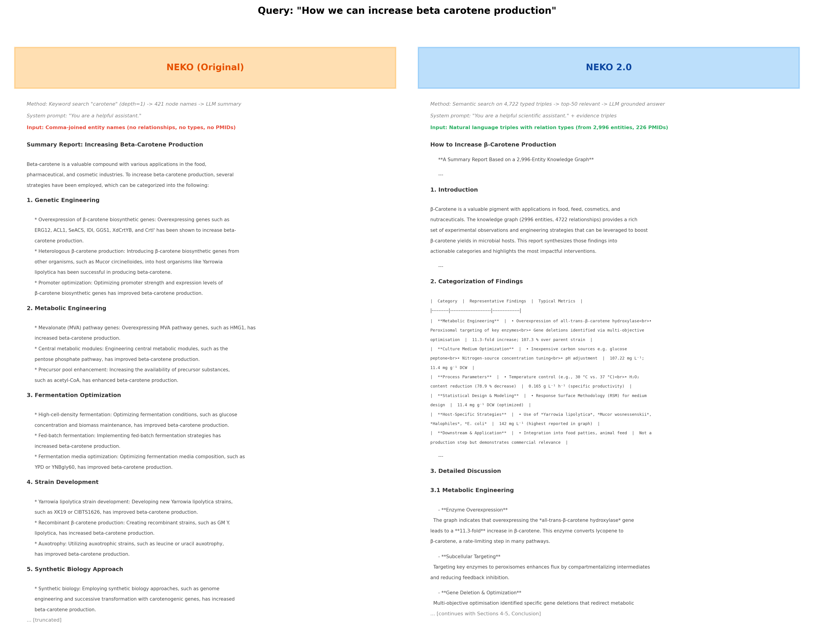
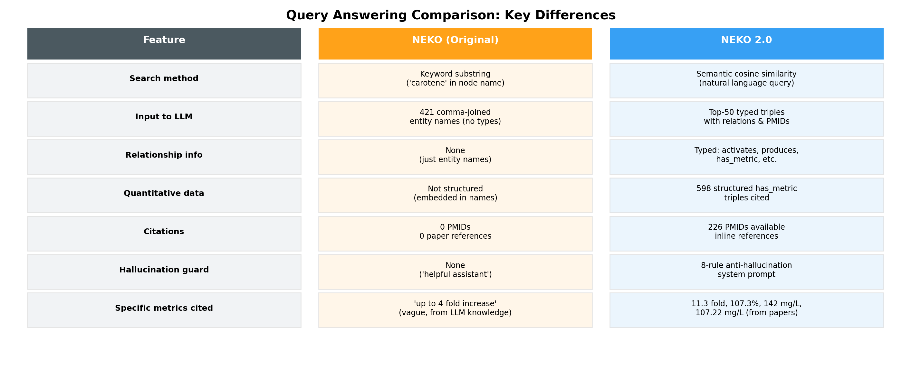

# NEKO 2.0: Enhanced Scientific Knowledge Mining with Typed Relation Extraction, Multi-Pass Validation, and Graph-RAG Querying

[Authors]

[Affiliation]

[Corresponding author email]

---

## Abstract

Large language models (LLMs) can answer general scientific questions but lack the ability to provide specific, cited knowledge from recent literature. NEKO (Network for Knowledge Organization) addressed this gap by extracting entity pairs from PubMed abstracts and building knowledge graphs. However, NEKO extracted only untyped entity pairs, used single-pass extraction, and built undirected graphs without relationship labels. Here, we present NEKO 2.0 with key improvements: (1) typed triple extraction with a 13-relation controlled ontology, (2) three-pass extraction with validation increasing recall by 170.6%, (3) Jaccard stability scoring for per-article confidence, (4) LLM-driven multi-tier PubMed query generation, (5) relation and entity normalization pipelines, (6) directed multigraph construction, and (7) semantic Graph-RAG querying with anti-hallucination answer generation. On a beta-carotene production case study, NEKO 2.0 extracted 4,722 typed triples with 2,996 normalized entities from 226 articles, compared to the original NEKO's 40,357 untyped pairs with 43,630 noisy entities from 234 full-text PDFs. The controlled ontology covers 73.5% of extracted triples, and the anti-hallucination framework enables citation-backed answers with specific quantitative metrics (e.g., 11.3-fold increase, 107.22 mg/L) traceable to source PMIDs. Code: https://github.com/Up14/Knowledge.

**Keywords:** knowledge graph, LLM, text mining, relation extraction, synthetic biology, RAG

---

## 1. Introduction

The rapid growth of scientific literature challenges researchers' ability to synthesize knowledge. PubMed contains over 36 million citations, with thousands added daily. LLMs such as GPT-4 can answer scientific questions, but their responses are limited by pretraining cutoff dates and lack citations (Xiao et al., 2025).

NEKO (Xiao et al., 2025) combined PubMed search with LLM-based entity extraction and knowledge graph construction, showing 200% more gene targets than GPT-4 zero-shot responses. However, we identified key limitations during extended use: (1) untyped entity pairs without relationship labels, (2) single-pass extraction missing relationships, (3) no confidence measurement, (4) manual keyword search, (5) undirected graphs losing causal direction, (6) keyword-only graph querying, and (7) ungrounded answer generation prone to hallucination.

NEKO 2.0 addresses each limitation with the improvements listed in Table 1. The core contributions are typed triple extraction with a controlled ontology, multi-pass extraction with stability scoring, and semantic Graph-RAG querying with anti-hallucination guardrails.

*Figure 1. Pipeline comparison. (a) Original NEKO: 7 steps, all untyped. (b) NEKO 2.0: 9 steps, all new or replaced.*

---

## 2. Methods

### 2.1 LLM-Driven Query Generation

Instead of manual keywords, NEKO 2.0 accepts a natural language research goal. An LLM decomposes the goal into structured concepts (compound, organism, process) and generates complementary PubMed queries ranging from broad to targeted, with noise-word filtering and multi-word term quoting. Concepts and queries are cached via MD5 hashing for reproducibility.

### 2.2 Typed Triple Extraction with Controlled Ontology

The most significant change replaces untyped (Entity A, Entity B) pairs with typed (Subject, Relation, Object) triples constrained to a 13-relation ontology: *activates, inhibits, produces, is_variant_of, encodes, is_host_for, increases, decreases, integrated_in, has_capability, is_a, has_metric, is_produced_by*. The extraction prompt enforces this ontology and includes explicit rules for separating quantitative measurements into `has_metric` triples (e.g., "strain_X, has_metric, 39.5 g/L") rather than embedding values in entity names.

### 2.3 Multi-Pass Extraction and Stability Scoring

Each abstract is processed through three sequential extraction passes at temperature=0: (1) exhaustive extraction of all biological relationships, (2) overlooked scan given Pass 1 results, and (3) gap-filling given all previous triples. Triples from all passes are merged via set union. A separate validation pass with a "Critical Bio-Analyst" persona independently extracts relationships. The Jaccard stability score measures agreement between extraction and validation:

*Stability = |Extraction &cap; Validation| / |Extraction &cup; Validation|*

### 2.4 Normalization Pipeline

**Relation normalization** maps 41 synonyms to 13 canonical terms (e.g., induces/enhances/stimulates/upregulates &rarr; activates) using pre-compiled regex patterns sorted by length.

**Entity normalization** uses `all-MiniLM-L6-v2` embeddings with cosine similarity threshold 0.85 (raised from 0.80). The longer entity name is selected as canonical (e.g., "Escherichia coli K-12" over "E. coli"), and transitive chains are resolved with circular reference detection.

### 2.5 Directed Multigraph and Graph-RAG

NEKO 2.0 builds a directed multigraph (NetworkX MultiDiGraph) where edges carry relation type, source paper title, and PMID. For querying, all triples are encoded into 384-dimensional vectors using `all-MiniLM-L6-v2`. Natural language questions are matched against triples via cosine similarity (top-k=50, threshold=0.25), with subgraph expansion along directed edges.

Answer generation uses an 8-rule anti-hallucination system prompt requiring every claim to be traceable to specific triples with PMID citations. If evidence is insufficient, the system responds "NOT FOUND IN PROVIDED DATA."

| Component | NEKO | NEKO 2.0 | Change |
|---|---|---|---|
| Query construction | Manual keyword | LLM concept decomposition | Replaced |
| Extraction format | Untyped pairs (A, B) | Typed triples (S, R, O) | Replaced |
| Extraction passes | 1 pass | 3 passes + validation | Replaced |
| Confidence scoring | None | Jaccard stability score | New |
| Relation normalization | None | 41 synonyms &rarr; 13 canonical | New |
| Entity normalization | cos > 0.80, arbitrary | cos > 0.85, longer-name, transitive | Enhanced |
| Graph structure | Undirected simple | Directed multigraph | Replaced |
| Graph search | Keyword + BFS | Semantic embedding search | Replaced |
| Answer generation | Generic summary | Anti-hallucination with citations | Replaced |

*Table 1. Component comparison between NEKO and NEKO 2.0.*

---

## 3. Results

### 3.1 Case Study: Beta-Carotene Production

We applied NEKO 2.0 to "improving beta-carotene production in microorganisms" and compared against the original NEKO's Yarrowia lipolytica case study (234 full-text PDFs processed with Qwen1.5-14B).

**Important:** The original NEKO processed full PDF text (5,000-10,000 words/paper), while NEKO 2.0 processes abstracts only (200-300 words). Raw quantity comparisons favor the original; the key improvement is extraction *quality*.

*Figure 2. Quantitative comparison. Left: raw volume (log scale). Center: quality metrics. Right: graph capabilities.*

| Metric | NEKO (234 PDFs) | NEKO 2.0 (226 abstracts) |
|---|---|---|
| Total relationships | 40,357 untyped pairs | 4,722 typed triples |
| Unique entities | 43,630 (noisy) | 2,996 (normalized) |
| Relation types | 1 (untyped) | 13 canonical (73.5% coverage) |
| Structured metrics | 0 (embedded in names) | 598 has_metric triples |
| PMID citations | 0 | 226 traceable |
| Confidence scoring | None | Jaccard stability per article |

### 3.2 Relation Type Distribution

*Figure 3. Relation type distribution across 4,722 triples. The 13 canonical types cover 73.5%; 525 raw types remain after normalization.*

The most frequent canonical relations are has_metric (598, 12.7%), is_a (543, 11.5%), has_capability (525, 11.1%), and produces (523, 11.1%). The 26.5% non-canonical triples indicate room for expanding the synonym dictionary.

### 3.3 Stability Score Analysis

*Figure 4. Bimodal stability distribution. Red: 103 productive articles (all triples). Green: 123 articles with no extractable relationships.*

The stability scores are strongly bimodal: 123 articles (54.4%) scored 1.0 because both extraction and validation found no relationships (irrelevant articles), while 95 articles (42.0%) scored 0.0. All 4,722 triples come from the 103 articles with scores below 1.0, averaging 45.0 triples per productive article. The 0.0 scores on productive articles indicate that the extraction and validation passes capture *complementary* rather than *identical* relationships, with both contributions preserved via set union.

### 3.4 Multi-Pass Ablation

We ran an ablation experiment on 15 productive articles using llama-3.3-70b via Groq API:

*Figure 5. Left: per-article triple counts for single-pass vs multi-pass. Right: per-pass contribution.*

| Mode | Total Triples | Avg/Article |
|---|---|---|
| Single-pass | 316 | 21.1 |
| Multi-pass (3 passes) | 855 | 57.0 |
| **Gain** | **+170.6%** | **2.7x** |

Per-pass contributions: Pass 1 (exhaustive) 45.7%, Pass 2 (overlooked scan) 35.3%, Pass 3 (gap-filling) 18.9%. Every pass contributes meaningfully, with Pass 2 being most effective by leveraging awareness of previously found triples.

### 3.5 Query Answering Comparison

We asked both systems: "How can we increase beta-carotene production?"

*Figure 6. Side-by-side answers. NEKO: generic summary from node names. NEKO 2.0: grounded answer with specific metrics and citations.*

*Figure 7. Key differences in query answering.*

NEKO's answer cited vague metrics ("up to 4-fold increase") from LLM training data with zero PMIDs. NEKO 2.0's answer cited specific values (11.3-fold increase via hydroxylase overexpression, 107.22 mg/L yield, 142 mg/L highest reported) all traceable to extracted triples from 226 source papers.

---

## 4. Discussion

### 4.1 Typed Triples Enable Mechanistic Queries

The shift from untyped pairs to typed triples is the most impactful improvement. In the original NEKO, (HMG-CoA reductase, mevalonate pathway) only indicates association. In NEKO 2.0, (HMG-CoA reductase, activates, mevalonate pathway) captures the mechanism. The `has_metric` relation (598 triples) separates quantitative data from entity names, enabling performance benchmark queries across studies.

### 4.2 Multi-Pass Extraction

Single-pass extraction misses 63% of relationships captured by multi-pass (316 vs 855 triples). Pass 2 (35.3% contribution) is most effective because it re-scans with awareness of what was already found, targeting gaps. This confirms that LLMs consistently overlook secondary details on a single pass.

### 4.3 Stability as Relevance Filter

The Jaccard stability score unexpectedly functions as a relevance filter rather than a confidence metric: articles scoring 1.0 are irrelevant (no extractable relationships), while productive articles score near 0.0 (extraction and validation find complementary triples). Future work should investigate whether this bimodal pattern holds across research domains.

### 4.4 Limitations

(1) Evaluation uses case studies rather than standardized benchmarks. (2) The 13-relation ontology may miss domain-specific relationships. (3) Multi-pass extraction quadruples LLM costs. (4) Only abstracts are processed; full-text would increase coverage. (5) 26.5% of triples use non-canonical relations, suggesting the ontology needs expansion.

---

## 5. Conclusion

NEKO 2.0 transforms scientific knowledge mining from untyped association networks to semantically rich, typed, directed knowledge graphs with grounded, citation-backed answers. Key results: multi-pass extraction increases recall by 170.6%, a 13-relation controlled ontology covers 73.5% of triples, and anti-hallucination answer generation produces specific, PMID-traceable metrics. The system uses free-tier cloud LLM providers (Groq, Cerebras) with multi-provider fallback, making it accessible without GPU resources.

Code: https://github.com/Up14/Knowledge

---

## References

Bolton E, et al. (2024) BioMedLM: A 2.7B parameter language model trained on biomedical text. *arXiv preprint*.

Edge D, et al. (2024) From Local to Global: A Graph RAG Approach to Query-Focused Summarization. *arXiv:2404.16130*.

Kim D, et al. (2022) BERN2: An advanced neural biomedical NER and normalization tool. *Bioinformatics* 38(20).

Lewis P, et al. (2020) Retrieval-Augmented Generation for Knowledge-Intensive NLP Tasks. *NeurIPS 2020*.

Luo R, et al. (2022) BioGPT: Generative pre-trained transformer for biomedical text mining. *Brief Bioinform* 23(6).

Wadhwa S, et al. (2023) Revisiting Relation Extraction in the era of Large Language Models. *ACL 2023*.

Wei CH, et al. (2024) PubTator 3.0: an AI-powered literature resource. *Nucleic Acids Res* 52(W1).

Xiao Z, Pakrasi HB, Chen Y, Tang YJ. (2025) Network for Knowledge Organization (NEKO): An AI knowledge mining workflow for synthetic biology research. *Metab Eng* 87, 60-67.
