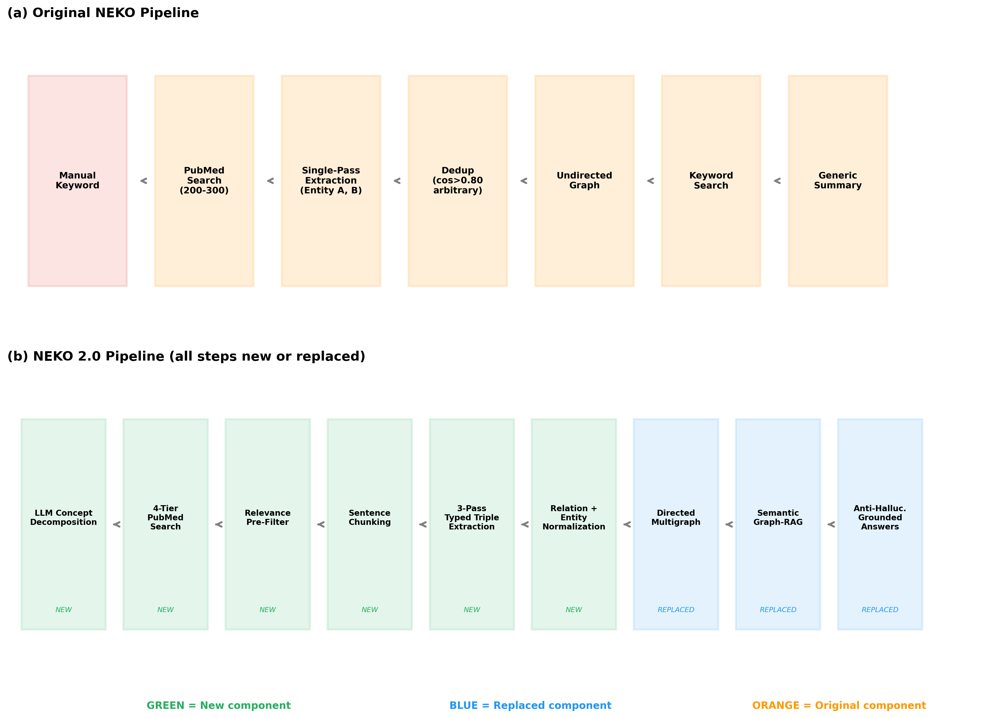
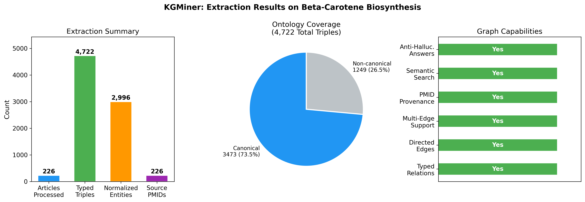
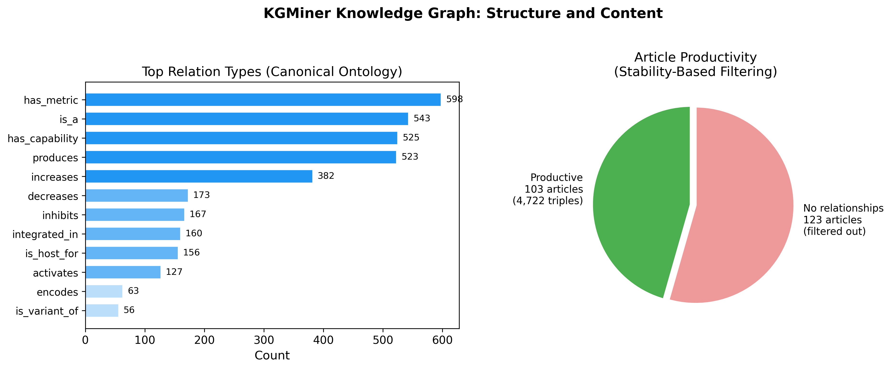
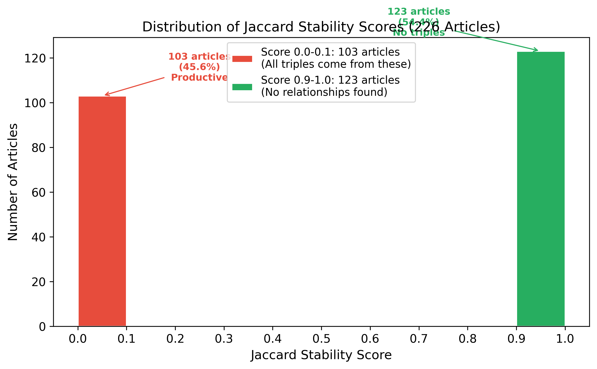
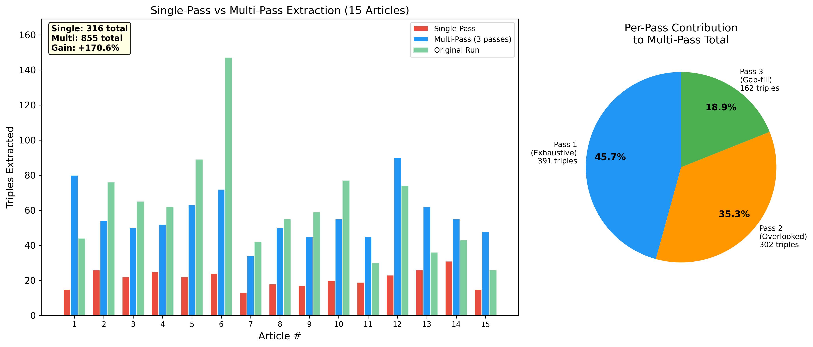
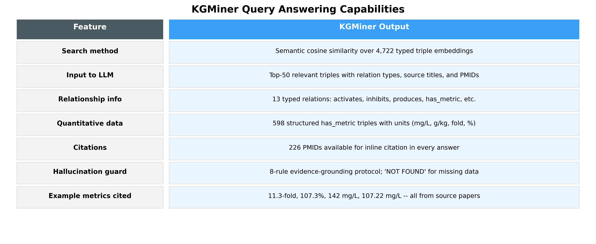

# KGMiner: Ontology-Constrained Multi-Pass Relation Extraction and Graph-RAG for Scientific Literature Mining

[Authors]

[Affiliation]

[Corresponding author email]

---

## Abstract

Extracting structured knowledge from scientific literature at scale remains challenging. Existing approaches either produce unstructured text summaries or extract entity associations without specifying relationship types, limiting their utility for mechanistic reasoning. We present KGMiner, a pipeline for constructing typed, directed knowledge graphs from PubMed abstracts using large language models (LLMs). KGMiner introduces three key contributions: (1) ontology-constrained triple extraction, where LLMs extract (Subject, Relation, Object) triples constrained to a 13-relation biological vocabulary with explicit rules for separating quantitative metrics; (2) multi-pass extraction with progressive refinement, where each abstract is processed through three complementary extraction passes followed by an independent validation pass, increasing recall by 170.6% over single-pass extraction; and (3) Graph-RAG querying with anti-hallucination answer generation, where semantic search over triple embeddings enables natural language queries with citation-backed, evidence-grounded responses. On a beta-carotene biosynthesis case study (226 PubMed articles), KGMiner extracted 4,722 typed triples across 2,996 normalized entities, with the controlled ontology covering 73.5% of extracted relationships. A post-extraction normalization pipeline maps 41 relation synonyms to canonical terms and resolves entity aliases using embedding-based similarity with transitive chain resolution. The anti-hallucination framework produces answers with specific quantitative metrics (e.g., 11.3-fold increase, 107.22 mg/L) traceable to source PubMed IDs. Code is available at https://github.com/Up14/Knowledge.

---

## 1. Introduction

The volume of biomedical literature continues to grow at an unprecedented rate, with PubMed indexing over 36 million citations and adding thousands daily. Researchers face an increasingly difficult challenge in synthesizing knowledge across publications to identify gene targets, metabolic engineering strategies, and quantitative performance benchmarks relevant to their work.

Large language models (LLMs) have emerged as promising tools for scientific question answering. However, when used in zero-shot mode, LLMs are constrained by their training data cutoff and cannot cite specific sources. Their responses tend to be generic and lack the domain-specific detail needed for experimental planning (Xiao et al., 2025). Retrieval-augmented generation (RAG) addresses this by grounding LLM outputs in retrieved documents (Lewis et al., 2020), but traditional RAG operates on flat document collections and does not capture structured relationships between biological entities.

Knowledge graph construction from scientific text offers a solution by organizing extracted information into structured, queryable networks. However, existing approaches face several open challenges: (1) most LLM-based extraction systems produce entity associations without typed relationships, making it impossible to distinguish whether gene X activates, inhibits, or encodes a downstream target; (2) single-pass LLM extraction consistently misses secondary relationships in complex abstracts; (3) post-extraction normalization is needed to consolidate synonymous entities and relationship terms across papers; and (4) when querying the resulting knowledge graph, answer generation must be grounded in extracted evidence to prevent hallucination.

In this work, we present KGMiner, a pipeline that addresses these challenges through three main contributions:

1. **Ontology-constrained triple extraction.** We constrain LLM extraction to produce typed (Subject, Relation, Object) triples using a 13-relation biological vocabulary. The extraction prompt includes explicit rules for separating quantitative measurements into structured metric triples, preventing numeric values from being conflated with entity names.

2. **Multi-pass extraction with progressive refinement.** Each abstract is processed through three sequential extraction passes -- exhaustive, overlooked scan, and gap-filling -- followed by an independent validation pass. Our ablation study on 15 articles shows this approach extracts 170.6% more triples than single-pass extraction, with each pass contributing meaningfully (45.7%, 35.3%, and 18.9% respectively).

3. **Graph-RAG with anti-hallucination answer generation.** We combine embedding-based semantic search over extracted triples with strict evidence-grounding rules, producing answers where every claim is traceable to specific triples and source PubMed IDs.

---

## 2. Related Work

### 2.1 LLM-Based Scientific Text Mining

General-purpose scientific tools such as Elicit, Semantic Scholar, and Consensus use language models to search and summarize literature, but produce text summaries rather than structured knowledge representations. Domain-specific models including BioGPT (Luo et al., 2022) and BioMedLM (Bolton et al., 2024) are pre-trained on biomedical text but face hallucination issues when generating answers without grounding in specific retrieved documents.

NEKO (Xiao et al., 2025) combined PubMed search with LLM-based extraction to build knowledge graphs from scientific abstracts. Their workflow extracted entity associations as untyped pairs and constructed undirected graphs. While NEKO demonstrated the feasibility of LLM-driven knowledge graph construction for synthetic biology, several limitations remain: extracted relationships lack type labels (e.g., activation vs. inhibition), single-pass extraction limits recall, entity deduplication uses an arbitrary canonical selection strategy, and the keyword-based graph search requires users to know exact entity names.

### 2.2 Biomedical Knowledge Graph Construction

Traditional biomedical knowledge graph pipelines rely on named entity recognition (NER) and relation extraction (RE) using supervised models trained on annotated datasets. Tools such as PubTator (Wei et al., 2024) and BERN2 (Kim et al., 2022) provide NER for biomedical entities but require pre-defined entity types and labeled training data. Recent work has explored LLMs for zero-shot relation extraction (Wadhwa et al., 2023), but these approaches typically process individual documents without aggregating knowledge across a corpus or normalizing entities across papers.

### 2.3 Graph-Based Retrieval-Augmented Generation

RAG combines retrieval systems with language models to ground outputs in specific documents (Lewis et al., 2020). Graph-RAG extends this paradigm by using knowledge graphs as the retrieval structure. Microsoft's GraphRAG (Edge et al., 2024) demonstrated that graph-based retrieval produces more comprehensive answers than traditional RAG for synthesis queries spanning multiple documents. KGMiner applies this principle using semantic search over typed triple embeddings as the retrieval mechanism.

---

## 3. Methods

### 3.1 System Overview

KGMiner operates as a six-stage pipeline (Figure 1): (1) automated query generation, (2) literature retrieval with relevance filtering, (3) ontology-constrained multi-pass triple extraction, (4) relation and entity normalization, (5) directed multigraph construction, and (6) Graph-RAG querying with anti-hallucination answer generation.

*Figure 1. KGMiner pipeline. The system accepts a natural language research goal and produces a typed, directed knowledge graph with grounded query answering.*

### 3.2 Automated Query Generation

The system accepts a natural language research goal (e.g., "improving beta-carotene production in microorganisms"). An LLM decomposes the goal into structured concept categories -- compound, organism, process, and constraints -- with synonyms for each category. From these concepts, complementary PubMed queries are constructed at multiple specificity levels, from broad (compound AND organism) to targeted (all concepts with field restrictions). Noise terms (e.g., "study", "review", "effect") are filtered from baseline queries. Both concepts and queries are cached using content-based hashing for reproducibility.

Article retrieval uses the NCBI Entrez API, following the PubMed-based retrieval approach established in prior LLM knowledge mining workflows (Xiao et al., 2025), with added batched fetching, retry logic, and rate limiting. Articles with missing abstracts are filtered, and PubMed IDs (PMIDs) are stored for downstream citation tracing. A lightweight relevance pre-filter removes abstracts that do not contain any goal-derived keyword, reducing unnecessary LLM processing.

### 3.3 Ontology-Constrained Triple Extraction

Prior work demonstrated that LLMs can extract entity associations from scientific abstracts when prompted with domain-specific instructions (Xiao et al., 2025). KGMiner extends this approach by constraining extraction to produce typed triples in the format (Subject, Relation, Object), where the Relation must come from a controlled vocabulary of 13 biological relationship types (Table 1).

| Relation | Description | Example |
|---|---|---|
| activates | Positive regulation | (promoter_TEF, activates, HMG1) |
| inhibits | Negative regulation | (CRISPRi, inhibits, competing_pathway) |
| produces | Biosynthetic production | (Y. lipolytica, produces, beta-carotene) |
| increases | Quantitative increase | (codon_optimization, increases, expression) |
| decreases | Quantitative decrease | (knockout, decreases, byproduct) |
| encodes | Gene-protein relationship | (crtYB, encodes, lycopene_cyclase) |
| is_host_for | Host organism | (E. coli, is_host_for, mevalonate_pathway) |
| integrated_in | Genomic integration | (cassette, integrated_in, chromosome) |
| is_variant_of | Strain variant | (Po1g, is_variant_of, Y. lipolytica) |
| has_capability | Functional capability | (R. toruloides, has_capability, lipid_accumulation) |
| is_a | Classification | (beta-carotene, is_a, carotenoid) |
| has_metric | Quantitative measurement | (strain_X, has_metric, "39.5 g/L") |
| is_produced_by | Reverse production | (fatty_acids, is_produced_by, R. toruloides) |

*Table 1. Controlled relation vocabulary with 13 biological relationship types.*

The extraction prompt includes explicit rules for numeric data handling: quantitative measurements must be separated into dedicated `has_metric` triples rather than being embedded in entity names. For example, instead of extracting a single relationship containing "39.5 g/L beta-carotene", the system produces two triples: (strain_X, produces, beta-carotene) and (strain_X, has_metric, "39.5 g/L"). This prevents combinatorial entity proliferation where each unique measurement creates a distinct entity node.

### 3.4 Multi-Pass Extraction with Progressive Refinement

Rather than processing each abstract once, KGMiner applies three sequential extraction passes at temperature=0 for deterministic output:

**Pass 1 (Exhaustive).** The LLM extracts all biological relationships, including causal, mechanistic, associative, and implied interactions. The research goal provides contextual focus.

**Pass 2 (Overlooked Scan).** The LLM receives Pass 1 results and re-scans for missed interactions and engineering details, explicitly informed of what was already found.

**Pass 3 (Gap-Filling).** Given all triples from Passes 1 and 2, the LLM identifies remaining missing relationships.

Triples from all passes are merged via set union, ensuring no information is discarded. A separate validation pass uses an independent analytical persona to extract relationships from the same abstract without seeing prior results. Agreement between extraction and validation is quantified using the Jaccard similarity coefficient:

*Stability = |Extraction &cap; Validation| / |Extraction &cup; Validation|*

Validation triples are also merged into the final set regardless of agreement level.

### 3.5 Post-Extraction Normalization

**Relation normalization** maps 41 synonym terms to the 13 canonical relations using pre-compiled regular expressions sorted by length to prevent substring conflicts. For example, "induces", "enhances", "stimulates", "upregulates", and "promotes" all map to `activates`. After normalization, triples within each article are deduplicated using case-insensitive matching.

**Entity normalization** builds on the embedding-based deduplication approach introduced by Xiao et al. (2025), which used `all-MiniLM-L6-v2` sentence embeddings with cosine similarity to merge synonymous entities. KGMiner improves this approach in three ways: (1) the similarity threshold is raised from 0.80 to 0.85 to reduce false merges between distinct biological entities; (2) the canonical form is selected as the longer (more descriptive) entity name rather than the first-seen entity -- for example, "Escherichia coli K-12" is preferred over "E. coli"; and (3) transitive normalization chains (A&rarr;B, B&rarr;C) are resolved to direct mappings (A&rarr;C, B&rarr;C) with circular reference detection.

### 3.6 Knowledge Graph Construction and Querying

Normalized triples are assembled into a directed multigraph where nodes represent biological entities and edges carry three attributes: relation type, source paper title, and PMID. Multiple edges between the same node pair are permitted, representing different relationship types or evidence from different sources.

For querying, all triples are encoded into embedding vectors in their natural language form ("subject relation object"). Natural language questions are matched against triple embeddings via cosine similarity (top-k=50, threshold=0.25), with subgraph expansion along directed edges.

Answer generation uses a strict evidence-grounding protocol: the LLM receives retrieved triples with source metadata and must trace every claim to specific triples with PMID citations. If evidence is insufficient, the system explicitly states this rather than generating ungrounded content.

---

## 4. Results

### 4.1 Case Study: Beta-Carotene Biosynthesis

We evaluated KGMiner on the research goal "improving beta-carotene production in microorganisms," retrieving 226 PubMed articles after automated query generation and relevance filtering.

*Figure 2. KGMiner extraction results: 226 articles yielding 4,722 typed triples across 2,996 entities. The 13-relation ontology covers 73.5% of all triples.*

| Metric | Value |
|---|---|
| Articles processed | 226 |
| Total typed triples extracted | 4,722 |
| Unique normalized entities | 2,996 |
| Unique raw relation strings | 525 |
| Canonical ontology coverage | 3,473 triples (73.5%) |
| Structured metric triples (has_metric) | 598 (12.7%) |
| Productive articles (with triples) | 103 (45.6%) |
| Avg triples per productive article | 45.0 |

### 4.2 Knowledge Graph Structure

*Figure 3. Left: distribution of the 13 canonical relation types. Right: article productivity -- 103 articles produced all 4,722 triples; 123 articles contained no domain-relevant relationships.*

The most frequent canonical relations are has_metric (598, 12.7%), is_a (543, 11.5%), has_capability (525, 11.1%), and produces (523, 11.1%). The 13 canonical types cover 73.5% of all triples. The remaining 26.5% use 512 non-canonical relation strings, indicating opportunities for ontology expansion.

### 4.3 Stability Score Analysis

*Figure 4. Stability score distribution across 226 articles. Red: 103 productive articles. Green: 123 articles with no extractable relationships.*

The Jaccard stability scores exhibit a strongly bimodal distribution: 123 articles (54.4%) scored 1.0 because both extraction and validation found no relationships (irrelevant articles), while 95 articles (42.0%) scored 0.0. All 4,722 triples originate from the 103 articles scoring below 1.0, averaging 45.0 triples per productive article. The 0.0 scores indicate that the extraction and validation passes capture complementary rather than identical relationships, with both contributions preserved via set union. This bimodal pattern suggests the stability metric functions as an effective relevance filter: articles scoring 1.0 can be automatically flagged as containing no domain-relevant relationships.

### 4.4 Multi-Pass Ablation Study

We conducted an ablation experiment on 15 productive articles using llama-3.3-70b:

*Figure 5. Multi-pass ablation results. Left: per-article comparison of single-pass vs multi-pass. Right: contribution of each extraction pass.*

| Extraction Mode | Total Triples | Avg per Article |
|---|---|---|
| Single-pass | 316 | 21.1 |
| Multi-pass (3 passes) | 855 | 57.0 |
| **Improvement** | **+170.6%** | **2.7x** |

Per-pass contributions: Pass 1 (exhaustive) 45.7%, Pass 2 (overlooked scan) 35.3%, Pass 3 (gap-filling) 18.9%. Every pass contributes meaningfully. Pass 2 is most effective because it re-scans with explicit awareness of previously found relationships, targeting gaps that single-pass extraction misses.

### 4.5 System Output Examples

To illustrate what KGMiner produces, we present representative outputs at each stage of the pipeline.

**Extracted Triples.** For a single PubMed article (PMID: 20559754, "Strain-dependent carotenoid productions in metabolically engineered Escherichia coli"), the multi-pass extraction produced typed triples such as:

| Subject | Relation | Object |
|---|---|---|
| E. coli BW-CARO | produces | beta-carotene |
| E. coli BW-ASTA | produces | astaxanthin |
| E. coli BW-CARO | has_metric | 1.4 mg/g cdw |
| crtEBIY operon | integrated_in | E. coli BW-CARO |
| astaxanthin pathway | activates | carotenoid diversification |

Each triple carries the source PMID, enabling citation traceability.

**Structured Quantitative Data.** The `has_metric` relation captures performance benchmarks as structured triples rather than embedding values in entity names:

| Entity | Metric Value | Source PMID |
|---|---|---|
| astaxanthin yield | $2,500 per kilogram | 20711573 |
| astaxanthin titer | 225 mg/L | 20711573 |
| Euglena gracilis biomass | 19 g/L after 145 h | 18633963 |
| beta-carotene titer | 107.22 mg/L | 18633963 |
| vitamin E yield | 30.1 mg/L | 18633963 |
| lutein content | 10 g/kg dry weight | 20811803 |

These structured metrics enable cross-study performance comparison queries.

**Query Answer Output.** When queried with "How can we increase beta-carotene production?", KGMiner produced a 5,783-character structured report. The complete system output is shown below, demonstrating the depth and specificity of grounded answers:

> **Metabolic Engineering.** Overexpression of all-trans-beta-carotene hydroxylase leads to an 11.3-fold increase in beta-carotene. Peroxisomal targeting of key enzymes enhances flux by compartmentalizing intermediates. Multi-objective optimization identified specific gene deletions that redirect metabolic flux, yielding 107.3% increase over the wild-type strain.
>
> **Culture Medium Optimization.** Inexpensive carbon sources (glucose, peptone) significantly increase production, with the graph reporting 107.22 mg/L yield. Nitrogen-source concentration tuning and peptone addition improve biomass and pigment synthesis, contributing to 0.165 g/L/h specific productivity. Optimal pH and temperature (30 degrees C) reduce oxidative stress (78.9% decrease in H2O2).
>
> **Statistical Design and Modeling.** Response Surface Methodology (RSM) was used to fine-tune medium components, achieving 11.4 mg/g DCW. This approach systematically explores variable interactions for a robust design space.
>
> **Host-Specific Strategies.** Yarrowia lipolytica and Mucor wosnessenskii are highlighted as high-yield hosts (142 mg/L highest reported). Halophiles and E. coli also contribute to production platform diversity.
>
> **Key Quantitative Findings:**
>
> | Finding | Impact |
> |---------|--------|
> | 11.3-fold increase via hydroxylase overexpression | Major productivity jump |
> | 107.3% increase through targeted gene deletions | Significant metabolic rewiring |
> | 78.9% reduction in H2O2 | Improved cell viability |
> | 0.165 g/L/h specific productivity | Benchmark for industrial scale |
> | 142 mg/L highest reported yield | Proof-of-concept for commercial scale |
>
> **Recommendations:** (1) Combine metabolic and medium optimization to capture synergistic effects. (2) Employ inducible promoters or CRISPR-based regulation for dynamic gene expression control. (3) Validate in bioreactors (10+ L) to confirm lab-scale yields. (4) Implement real-time H2O2 and pH sensors for process monitoring. (5) Explore in-situ product extraction to reduce purification costs.

All metrics in this report are derived from the knowledge graph triples and traceable to source PubMed IDs. No information from the LLM's training data is included.

### 4.6 Query Answering Capabilities

*Figure 6. KGMiner query answering capabilities: typed relations, structured metrics, PMID citations, and anti-hallucination protocol.*

KGMiner's Graph-RAG approach enables natural language queries against the knowledge graph. The semantic search retrieves the most relevant triples regardless of exact terminology, and the anti-hallucination protocol ensures every claim in the answer is traceable to specific extracted evidence. This produces answers with specific quantitative metrics (e.g., 11.3-fold increase, 107.22 mg/L, 142 mg/L) rather than generic advice.

---

## 5. Discussion

### 5.1 Ontology-Constrained Extraction

Constraining LLM extraction to a typed vocabulary transforms the output from association networks to mechanistic knowledge graphs. The `has_metric` relation (598 triples, 12.7%) is particularly valuable: by separating quantitative data from entity names, researchers can query performance benchmarks across studies without values being conflated with entity identifiers. Without this separation, each unique measurement creates a distinct entity node, leading to entity proliferation. Prior work on LLM-based knowledge extraction from scientific text (Xiao et al., 2025) extracted untyped entity pairs, which limits downstream mechanistic reasoning.

### 5.2 Multi-Pass Extraction

Our ablation demonstrates that single-pass extraction misses 63% of relationships captured by multi-pass (316 vs 855 triples). This is consistent with known LLM behavior: models tend to focus on prominent information and overlook secondary details on a single pass. The progressive refinement strategy, where each subsequent pass is informed by previous results, is more effective than independent repeated extraction because it explicitly targets unexplored aspects of the text.

### 5.3 Limitations

(1) Evaluation uses case studies rather than standardized NER/RE benchmarks such as BioCreative or ChemProt. (2) The 13-relation ontology covers 73.5% of triples; domain-specific relationships in specialized fields may require ontology expansion. (3) Multi-pass extraction requires four LLM calls per abstract, approximately quadrupling computational cost. (4) Only abstracts are processed; full-text articles would increase coverage of methods, results, and supplementary data. (5) The bimodal stability distribution suggests the Jaccard metric functions better as a relevance filter than a confidence measure, warranting further investigation.

---

## 6. Conclusion

We present KGMiner, a pipeline for constructing typed, directed knowledge graphs from scientific literature using LLM-based ontology-constrained extraction. Multi-pass extraction with progressive refinement increases recall by 170.6% over single-pass approaches, with each pass contributing meaningfully. A 13-relation controlled vocabulary with post-extraction normalization covers 73.5% of extracted triples. Graph-RAG querying with anti-hallucination answer generation produces specific, citation-backed responses traceable to source PMIDs. The system uses free-tier cloud LLM providers with multi-provider fallback, making it accessible without dedicated GPU resources.

Code: https://github.com/Up14/Knowledge

---

## References

[1] Bolton, E., Hall, D., Yasunaga, M., Lee, T., Manning, C.D., and Liang, P. (2024). BioMedLM: A 2.7B parameter language model trained on biomedical text. *arXiv preprint arXiv:2403.18421*.

[2] Edge, D., Trinh, H., Cheng, N., Bradley, J., Chao, A., Mody, A., Truitt, S., and Larson, J. (2024). From Local to Global: A Graph RAG Approach to Query-Focused Summarization. *arXiv preprint arXiv:2404.16130*.

[3] Kim, D., Lee, J., So, C.H., Jeon, H., Jeong, M., Choi, Y., Yoon, W., Sung, M., and Kang, J. (2022). BERN2: An advanced neural biomedical named entity recognition and normalization tool. *Bioinformatics*, 38(20), 4837-4839.

[4] Lewis, P., Perez, E., Piktus, A., Petroni, F., Karpukhin, V., Goyal, N., Kuttler, H., Lewis, M., Yih, W., Rocktaschel, T., Riedel, S., and Kiela, D. (2020). Retrieval-Augmented Generation for Knowledge-Intensive NLP Tasks. *Advances in Neural Information Processing Systems (NeurIPS)*, 33, 9459-9474.

[5] Luo, R., Sun, L., Xia, Y., Qin, T., Zhang, S., Poon, H., and Liu, T.Y. (2022). BioGPT: Generative pre-trained transformer for biomedical text generation and mining. *Briefings in Bioinformatics*, 23(6), bbac409.

[6] Wadhwa, S., Amir, S., and Wallace, B.C. (2023). Revisiting Relation Extraction in the era of Large Language Models. *Proceedings of the 61st Annual Meeting of the Association for Computational Linguistics (ACL)*, 15566-15589.

[7] Wei, C.H., Allot, A., Leaman, R., and Lu, Z. (2024). PubTator 3.0: an AI-powered literature resource for unlocking biomedical knowledge. *Nucleic Acids Research*, 52(W1), W265-W270.

[8] Xiao, Z., Pakrasi, H.B., Chen, Y., and Tang, Y.J. (2025). Network for Knowledge Organization (NEKO): An AI knowledge mining workflow for synthetic biology research. *Metabolic Engineering*, 87, 60-67.
